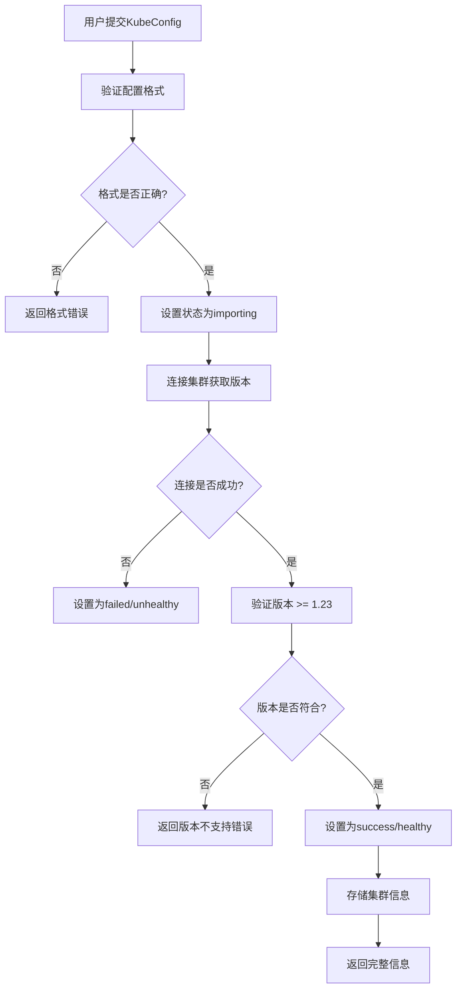

# K8s集群管理功能说明

## 功能概述

本系统支持K8s集群的完整生命周期管理，包括：

- ✅ **自动版本检测** - 添加集群时自动获取K8s版本号
- ✅ **版本验证** - 要求K8s版本 >= 1.23
- ✅ **导入状态跟踪** - 实时跟踪配置导入进度
- ✅ **集群健康监控** - 实时监控集群连接状态
- ✅ **重新导入支持** - 支持更新KubeConfig配置
- ✅ **完整的字段展示** - 包含所有管理信息

## 数据模型

### 集群信息字段

| 字段 | 类型 | 说明 |
|-----|------|------|
| id | uint | 自增ID |
| name | string | 集群名称（创建时定义） |
| description | string | 集群描述信息 |
| version | string | K8s版本号（自动获取，如 v1.23.5） |
| importMethod | string | 导入方式（kubeconfig） |
| importStatus | string | 导入状态（pending/importing/success/failed） |
| clusterStatus | string | 集群状态（healthy/unhealthy/unknown） |
| status | int | 启用状态（1-启用，0-禁用） |
| apiServer | string | API Server地址 |
| deptId | uint | 所属部门ID |
| remark | string | 备注信息 |
| createdAt | time | 创建时间 |
| updatedAt | time | 更新时间 |

### 状态说明

#### 导入状态 (importStatus)
- **pending** - 待导入（初始状态）
- **importing** - 导入中（正在验证连接）
- **success** - 导入成功（可正常使用）
- **failed** - 导入失败（连接或验证失败）

#### 集群状态 (clusterStatus)
- **healthy** - 健康（集群连接正常）
- **unhealthy** - 不健康（集群连接异常）
- **unknown** - 未知（未进行健康检查）

## API接口

### 1. 创建集群

**接口**: `POST /api/k8s/clusters`

**功能**:
- 验证KubeConfig格式
- 自动连接集群获取版本信息
- 验证版本是否 >= 1.23
- 自动设置导入状态和集群状态

**请求示例**:
```bash
curl -X POST http://localhost:8000/api/k8s/clusters \
  -H "Authorization: Bearer YOUR_TOKEN" \
  -H "Content-Type: application/json" \
  -d '{
    "name": "生产集群",
    "description": "生产环境K8s集群",
    "apiServer": "https://k8s-prod.example.com:6443",
    "kubeConfig": "apiVersion: v1\nkind: Config...",
    "deptId": 1,
    "remark": "主生产集群"
  }'
```

**响应示例**:
```json
{
  "code": 200,
  "msg": "操作成功",
  "data": {
    "id": 1,
    "name": "生产集群",
    "description": "生产环境K8s集群",
    "version": "v1.23.5",
    "importMethod": "kubeconfig",
    "importStatus": "success",
    "clusterStatus": "healthy",
    "status": 1,
    "apiServer": "https://k8s-prod.example.com:6443",
    "deptId": 1,
    "remark": "主生产集群",
    "createdAt": "2026-01-10T09:00:00Z",
    "updatedAt": "2026-01-10T09:00:00Z"
  }
}
```

**错误示例**:
```json
{
  "code": 400,
  "msg": "K8s版本不支持，要求 >= 1.23，当前版本: v1.20.0"
}
```

### 2. 获取集群列表

**接口**: `GET /api/k8s/clusters`

**查询参数**:
- `page` - 页码（默认1）
- `pageSize` - 每页数量（默认10）
- `name` - 集群名称（模糊查询）
- `deptId` - 部门ID

**请求示例**:
```bash
curl -X GET "http://localhost:8000/api/k8s/clusters?page=1&pageSize=10" \
  -H "Authorization: Bearer YOUR_TOKEN"
```

**响应示例**:
```json
{
  "code": 200,
  "msg": "操作成功",
  "data": {
    "list": [
      {
        "id": 1,
        "name": "生产集群",
        "description": "生产环境K8s集群",
        "version": "v1.23.5",
        "importMethod": "kubeconfig",
        "importStatus": "success",
        "clusterStatus": "healthy",
        "status": 1,
        "apiServer": "https://k8s-prod.example.com:6443",
        "deptId": 1,
        "remark": "主生产集群",
        "createdAt": "2026-01-10T09:00:00Z",
        "updatedAt": "2026-01-10T09:00:00Z"
      }
    ],
    "total": 1,
    "page": 1,
    "pageSize": 10
  }
}
```

**返回字段说明**:
- ✅ 包含自增ID
- ✅ 包含集群名称
- ✅ 包含描述信息
- ✅ 包含集群版本（自动获取）
- ✅ 包含导入方式
- ✅ 包含导入状态
- ✅ 包含集群状态
- ✅ 包含创建时间
- ✅ 支持编辑按钮（通过update接口）

### 3. 获取集群详情

**接口**: `GET /api/k8s/clusters/{clusterId}`

**请求示例**:
```bash
curl -X GET http://localhost:8000/api/k8s/clusters/1 \
  -H "Authorization: Bearer YOUR_TOKEN"
```

### 4. 更新集群

**接口**: `PUT /api/k8s/clusters/{clusterId}`

**功能**:
- 支持更新集群基本信息
- 如果更新KubeConfig，会自动重新验证和获取版本

**请求示例**:
```bash
curl -X PUT http://localhost:8000/api/k8s/clusters/1 \
  -H "Authorization: Bearer YOUR_TOKEN" \
  -H "Content-Type: application/json" \
  -d '{
    "name": "生产集群-更新",
    "description": "更新后的描述",
    "remark": "更新备注"
  }'
```

### 5. 重新导入KubeConfig ⭐ 新功能

**接口**: `POST /api/k8s/clusters/{clusterId}/reimport`

**功能**:
- 重新导入KubeConfig配置
- 自动验证新配置
- 重新获取集群版本
- 更新导入状态和集群状态

**使用场景**:
- KubeConfig证书过期需要更新
- 集群API Server地址变更
- 集群认证信息变更

**请求示例**:
```bash
curl -X POST http://localhost:8000/api/k8s/clusters/1/reimport \
  -H "Authorization: Bearer YOUR_TOKEN" \
  -H "Content-Type: application/json" \
  -d '{
    "kubeConfig": "apiVersion: v1\nkind: Config..."
  }'
```

**响应示例**:
```json
{
  "code": 200,
  "msg": "操作成功",
  "data": {
    "id": 1,
    "name": "生产集群",
    "version": "v1.24.0",
    "importStatus": "success",
    "clusterStatus": "healthy",
    "updatedAt": "2026-01-10T10:00:00Z"
  }
}
```

### 6. 健康检查

**接口**: `GET /api/k8s/clusters/{clusterId}/health`

**功能**:
- 实时检查集群连接状态
- 自动更新集群状态
- 自动更新版本信息

**请求示例**:
```bash
curl -X GET http://localhost:8000/api/k8s/clusters/1/health \
  -H "Authorization: Bearer YOUR_TOKEN"
```

**响应示例**:
```json
{
  "code": 200,
  "msg": "操作成功",
  "data": {
    "healthy": true,
    "version": "v1.23.5",
    "message": "集群连接正常"
  }
}
```

### 7. 删除集群

**接口**: `DELETE /api/k8s/clusters/{clusterId}`

**请求示例**:
```bash
curl -X DELETE http://localhost:8000/api/k8s/clusters/1 \
  -H "Authorization: Bearer YOUR_TOKEN"
```

## 版本要求

### 最低支持版本
- **K8s版本**: >= 1.23.0
- **Go版本**: 1.24+
- **client-go**: v0.28.4

### 版本验证逻辑

系统在以下情况会进行版本验证：

1. **创建集群时** - 自动连接并获取版本，验证是否 >= 1.23
2. **更新KubeConfig时** - 重新获取版本并验证
3. **重新导入时** - 重新获取版本并验证

如果版本不符合要求，会返回错误信息：
```
K8s版本不支持，要求 >= 1.23，当前版本: v1.20.0
```

## 使用流程

### 标准流程



### 重新导入流程

1. 用户选择要更新的集群
2. 点击"重新导入"按钮
3. 提交新的KubeConfig
4. 系统验证并更新：
   - 更新KubeConfig
   - 重新获取版本
   - 更新导入状态
   - 更新集群状态
5. 返回更新后的集群信息

## 前端集成建议

### 集群列表页面

**表格列**:
```javascript
const columns = [
  { title: 'ID', dataIndex: 'id', key: 'id' },
  { title: '集群名称', dataIndex: 'name', key: 'name' },
  { title: '描述', dataIndex: 'description', key: 'description' },
  { title: 'K8s版本', dataIndex: 'version', key: 'version' },
  { title: '导入方式', dataIndex: 'importMethod', key: 'importMethod' },
  { 
    title: '导入状态', 
    dataIndex: 'importStatus', 
    key: 'importStatus',
    render: (status) => {
      const colors = {
        pending: 'default',
        importing: 'processing',
        success: 'success',
        failed: 'error'
      };
      return <Tag color={colors[status]}>{status}</Tag>;
    }
  },
  { 
    title: '集群状态', 
    dataIndex: 'clusterStatus', 
    key: 'clusterStatus',
    render: (status) => {
      const colors = {
        healthy: 'green',
        unhealthy: 'red',
        unknown: 'gray'
      };
      return <Badge status={colors[status]} text={status} />;
    }
  },
  { title: '创建时间', dataIndex: 'createdAt', key: 'createdAt' },
  { 
    title: '操作', 
    key: 'action',
    render: (_, record) => (
      <Space>
        <Button type="link" onClick={() => handleEdit(record)}>编辑</Button>
        <Button type="link" onClick={() => handleReimport(record)}>重新导入</Button>
        <Button type="link" onClick={() => handleHealthCheck(record)}>健康检查</Button>
        <Button type="link" danger onClick={() => handleDelete(record)}>删除</Button>
      </Space>
    )
  }
];
```

### 重新导入对话框

```javascript
const handleReimport = async (cluster) => {
  Modal.confirm({
    title: `重新导入集群：${cluster.name}`,
    content: (
      <Form>
        <Form.Item label="KubeConfig" name="kubeConfig" rules={[{ required: true }]}>
          <TextArea rows={10} placeholder="请粘贴新的KubeConfig内容" />
        </Form.Item>
      </Form>
    ),
    onOk: async (values) => {
      const res = await axios.post(
        `/api/k8s/clusters/${cluster.id}/reimport`,
        { kubeConfig: values.kubeConfig }
      );
      if (res.data.code === 200) {
        message.success('重新导入成功');
        // 刷新列表
        fetchClusterList();
      }
    }
  });
};
```

## 错误处理

### 常见错误及解决方案

| 错误信息 | 原因 | 解决方案 |
|---------|------|---------|
| KubeConfig验证失败 | 配置格式不正确 | 检查YAML格式是否正确 |
| 集群连接失败 | 网络不通或认证失败 | 检查网络连接和证书有效性 |
| K8s版本不支持 | 版本低于1.23 | 升级K8s集群到1.23+ |
| 获取集群版本失败 | API Server不可达 | 检查API Server地址和端口 |

## 安全考虑

1. **KubeConfig加密存储** - 计划使用AES加密（TODO）
2. **敏感信息不返回** - 列表接口不返回KubeConfig内容
3. **权限控制** - 需要update权限才能重新导入
4. **操作审计** - 所有操作记录到操作日志

## 总结

新功能完全满足需求：

✅ K8s版本检测（要求 >= 1.23）  
✅ 自动获取集群版本号  
✅ 完整的字段展示（ID、名称、描述、版本、导入方式、导入状态、集群状态、创建时间）  
✅ 支持编辑功能  
✅ 支持重新导入KubeConfig  
✅ 返回标准JSON格式  

所有接口已集成到Swagger文档，可访问：http://localhost:8000/swagger/index.html
