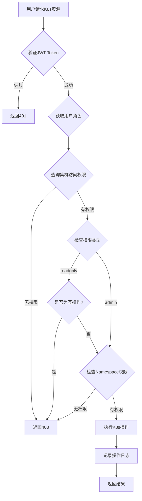

# K8s集群管理系统实现方案

## 一、项目重构方案

### 1.1 目录结构调整

```
devops/
├── models/
│   ├── users/           # 用户相关模型
│   │   ├── user.go
│   │   ├── role.go
│   │   ├── department.go
│   │   └── post.go
│   ├── k8s/             # K8s相关模型
│   │   ├── cluster.go   # 集群、权限、命名空间、操作日志
│   │   └── resource.go  # 资源定义（可选）
│   ├── menu.go
│   ├── login_log.go
│   └── operation_log.go
│
├── service/
│   ├── users/           # 用户相关服务
│   │   ├── user.go
│   │   ├── role.go
│   │   ├── department.go
│   │   └── post.go
│   ├── k8s/             # K8s相关服务
│   │   ├── cluster.go   # 集群管理
│   │   ├── namespace.go # 命名空间管理
│   │   ├── workload.go  # 工作负载管理
│   │   ├── service.go   # Service/Ingress管理
│   │   ├── config.go    # ConfigMap/Secret管理
│   │   ├── storage.go   # 存储管理
│   │   ├── node.go      # 节点管理
│   │   ├── event.go     # 事件查看
│   │   ├── terminal.go  # WebShell终端
│   │   └── permission.go # 权限检查
│   ├── captcha.go
│   ├── menu.go
│   └── ...
│
├── controller/
│   ├── users/           # 用户相关控制器
│   │   └── user.go
│   ├── k8s/             # K8s相关控制器
│   │   ├── cluster.go
│   │   ├── namespace.go
│   │   ├── workload.go
│   │   ├── service.go
│   │   ├── config.go
│   │   ├── storage.go
│   │   ├── node.go
│   │   ├── event.go
│   │   └── terminal.go
│   └── captcha.go
│
└── routers/
    ├── users/           # 用户相关路由
    │   ├── user.go
    │   ├── role.go
    │   ├── department.go
    │   └── post.go
    ├── k8s/             # K8s相关路由
    │   ├── cluster.go
    │   ├── namespace.go
    │   ├── workload.go
    │   ├── service.go
    │   ├── config.go
    │   ├── storage.go
    │   ├── node.go
    │   ├── event.go
    │   └── terminal.go
    ├── auth.go
    ├── menu.go
    ├── log.go
    └── router.go
```

### 1.2 重构步骤

1. **创建新目录结构**
2. **复制文件到新位置**
3. **更新package名称**
4. **更新所有import路径**
5. **测试编译和功能**

## 二、K8s集群管理功能设计

### 2.1 核心功能模块

#### 1. 集群管理（Cluster Management）
- **功能**：
  - 添加/删除/编辑K8s集群
  - 关联部门
  - 配置KubeConfig
  - 集群健康检查
  
- **API接口**：
  ```
  POST   /api/k8s/clusters              # 创建集群
  GET    /api/k8s/clusters              # 获取集群列表
  GET    /api/k8s/clusters/:id          # 获取集群详情
  PUT    /api/k8s/clusters/:id          # 更新集群
  DELETE /api/k8s/clusters/:id          # 删除集群
  GET    /api/k8s/clusters/:id/health   # 健康检查
  ```

#### 2. 权限管理（Access Control）
- **模型**：`ClusterAccess`
- **权限类型**：
  - `readonly`: 只读权限（查看、列表）
  - `admin`: 管理员权限（所有操作）
  
- **权限验证流程**：
  ```
  用户 → 用户角色 → 角色权限 → 集群访问权限 → Namespace权限
  ```

- **API接口**：
  ```
  POST   /api/k8s/clusters/:id/access   # 配置集群访问权限
  GET    /api/k8s/clusters/:id/access   # 获取集群访问权限
  DELETE /api/k8s/clusters/:id/access/:accessId # 删除权限
  ```

#### 3. Namespace管理
- **功能**：
  - 列表查看
  - 创建/删除Namespace
  - 配置资源配额
  - 查看Namespace详情
  
- **API接口**：
  ```
  GET    /api/k8s/clusters/:clusterId/namespaces
  POST   /api/k8s/clusters/:clusterId/namespaces
  GET    /api/k8s/clusters/:clusterId/namespaces/:name
  DELETE /api/k8s/clusters/:clusterId/namespaces/:name
  ```

#### 4. Workload管理
- **支持资源类型**：
  - Deployment
  - StatefulSet
  - DaemonSet
  - ReplicaSet
  - Pod
  
- **功能**：
  - 列表查看（支持多种过滤）
  - 创建/更新/删除
  - 扩缩容
  - 重启
  - 查看详情
  - 查看Yaml
  - 日志查看
  
- **API接口**：
  ```
  # Deployment
  GET    /api/k8s/clusters/:clusterId/namespaces/:ns/deployments
  POST   /api/k8s/clusters/:clusterId/namespaces/:ns/deployments
  GET    /api/k8s/clusters/:clusterId/namespaces/:ns/deployments/:name
  PUT    /api/k8s/clusters/:clusterId/namespaces/:ns/deployments/:name
  DELETE /api/k8s/clusters/:clusterId/namespaces/:ns/deployments/:name
  PUT    /api/k8s/clusters/:clusterId/namespaces/:ns/deployments/:name/scale
  POST   /api/k8s/clusters/:clusterId/namespaces/:ns/deployments/:name/restart
  
  # StatefulSet、DaemonSet类似
  ```

#### 5. Service & Ingress管理
- **功能**：
  - Service CRUD
  - Ingress CRUD
  - Endpoint查看
  
- **API接口**：
  ```
  GET    /api/k8s/clusters/:clusterId/namespaces/:ns/services
  POST   /api/k8s/clusters/:clusterId/namespaces/:ns/services
  GET    /api/k8s/clusters/:clusterId/namespaces/:ns/services/:name
  DELETE /api/k8s/clusters/:clusterId/namespaces/:ns/services/:name
  
  GET    /api/k8s/clusters/:clusterId/namespaces/:ns/ingresses
  POST   /api/k8s/clusters/:clusterId/namespaces/:ns/ingresses
  ...
  ```

#### 6. ConfigMap & Secret管理
- **功能**：
  - ConfigMap/Secret CRUD
  - 数据加密存储
  - 版本管理
  
- **API接口**：
  ```
  GET    /api/k8s/clusters/:clusterId/namespaces/:ns/configmaps
  POST   /api/k8s/clusters/:clusterId/namespaces/:ns/configmaps
  GET    /api/k8s/clusters/:clusterId/namespaces/:ns/configmaps/:name
  PUT    /api/k8s/clusters/:clusterId/namespaces/:ns/configmaps/:name
  DELETE /api/k8s/clusters/:clusterId/namespaces/:ns/configmaps/:name
  
  # Secret类似
  ```

#### 7. 存储管理
- **支持资源**：
  - PersistentVolume (PV)
  - PersistentVolumeClaim (PVC)
  - StorageClass
  
- **功能**：
  - 列表查看
  - 创建/删除
  - 绑定状态查看
  
- **API接口**：
  ```
  GET    /api/k8s/clusters/:clusterId/persistentvolumes
  GET    /api/k8s/clusters/:clusterId/storageclasses
  GET    /api/k8s/clusters/:clusterId/namespaces/:ns/persistentvolumeclaims
  POST   /api/k8s/clusters/:clusterId/namespaces/:ns/persistentvolumeclaims
  ...
  ```

#### 8. 节点管理
- **功能**：
  - 节点列表
  - 节点详情
  - 节点标签管理
  - 节点污点管理
  - 节点资源使用情况
  
- **API接口**：
  ```
  GET    /api/k8s/clusters/:clusterId/nodes
  GET    /api/k8s/clusters/:clusterId/nodes/:name
  PUT    /api/k8s/clusters/:clusterId/nodes/:name/labels
  PUT    /api/k8s/clusters/:clusterId/nodes/:name/taints
  ```

#### 9. 事件查看
- **功能**：
  - 集群级事件
  - Namespace级事件
  - 资源级事件
  - 事件过滤和搜索
  
- **API接口**：
  ```
  GET    /api/k8s/clusters/:clusterId/events
  GET    /api/k8s/clusters/:clusterId/namespaces/:ns/events
  GET    /api/k8s/clusters/:clusterId/namespaces/:ns/:resource/:name/events
  ```

#### 10. WebShell终端
- **功能**：
  - Pod容器终端
  - 支持多容器选择
  - 命令执行
  - 文件上传下载（可选）
  
- **技术实现**：
  - WebSocket连接
  - K8s exec API
  - xterm.js前端
  
- **API接口**：
  ```
  GET    /api/k8s/clusters/:clusterId/namespaces/:ns/pods/:pod/shell
         (WebSocket连接)
  ```

### 2.2 权限控制流程



### 2.3 数据库表设计

#### k8s_clusters (集群表)
```sql
CREATE TABLE k8s_clusters (
    id BIGINT PRIMARY KEY AUTO_INCREMENT,
    created_at DATETIME,
    updated_at DATETIME,
    deleted_at DATETIME,
    name VARCHAR(100) UNIQUE NOT NULL,
    description VARCHAR(500),
    api_server VARCHAR(500) NOT NULL,
    kube_config TEXT NOT NULL,
    version VARCHAR(50),
    status TINYINT DEFAULT 1,
    dept_id BIGINT,
    remark VARCHAR(500),
    INDEX idx_dept_id (dept_id),
    INDEX idx_deleted_at (deleted_at)
);
```

#### k8s_cluster_accesses (集群访问权限表)
```sql
CREATE TABLE k8s_cluster_accesses (
    id BIGINT PRIMARY KEY AUTO_INCREMENT,
    created_at DATETIME,
    updated_at DATETIME,
    deleted_at DATETIME,
    cluster_id BIGINT NOT NULL,
    role_id BIGINT NOT NULL,
    access_type VARCHAR(20) NOT NULL,  -- 'readonly' or 'admin'
    namespaces TEXT,  -- JSON数组
    INDEX idx_cluster_id (cluster_id),
    INDEX idx_role_id (role_id),
    INDEX idx_deleted_at (deleted_at)
);
```

#### k8s_namespaces (命名空间表)
```sql
CREATE TABLE k8s_namespaces (
    id BIGINT PRIMARY KEY AUTO_INCREMENT,
    created_at DATETIME,
    updated_at DATETIME,
    deleted_at DATETIME,
    cluster_id BIGINT NOT NULL,
    name VARCHAR(253) NOT NULL,
    labels TEXT,
    annotations TEXT,
    status VARCHAR(20),
    INDEX idx_cluster_id (cluster_id),
    INDEX idx_deleted_at (deleted_at)
);
```

#### k8s_operation_logs (K8s操作日志表)
```sql
CREATE TABLE k8s_operation_logs (
    id BIGINT PRIMARY KEY AUTO_INCREMENT,
    created_at DATETIME,
    cluster_id BIGINT NOT NULL,
    user_id BIGINT NOT NULL,
    username VARCHAR(100),
    operation VARCHAR(50) NOT NULL,  -- create/update/delete/get/list/exec
    resource VARCHAR(50) NOT NULL,   -- deployment/pod/service/...
    namespace VARCHAR(253),
    name VARCHAR(253),
    result VARCHAR(20),              -- success/failed
    message TEXT,
    ip VARCHAR(50),
    INDEX idx_cluster_id (cluster_id),
    INDEX idx_user_id (user_id),
    INDEX idx_created_at (created_at)
);
```

## 三、依赖包

```bash
# K8s客户端
go get k8s.io/client-go@latest
go get k8s.io/api@latest
go get k8s.io/apimachinery@latest

# WebSocket支持
go get github.com/gorilla/websocket

# YAML处理
go get gopkg.in/yaml.v3
```

## 四、实现优先级

### 第一阶段（核心功能）
1. ✅ 创建K8s模型
2. 集群管理CRUD
3. 权限管理
4. 权限验证中间件

### 第二阶段（基础资源）
1. Namespace管理
2. Deployment管理
3. Service管理
4. Pod查看和日志

### 第三阶段（高级功能）
1. StatefulSet/DaemonSet管理
2. ConfigMap/Secret管理
3. 存储管理
4. 节点管理
5. 事件查看

### 第四阶段（WebShell）
1. WebSocket连接
2. 终端交互
3. 多容器支持

## 五、配置示例

### config.yaml 新增配置
```yaml
# K8s管理配置
k8s:
  # 操作超时时间（秒）
  timeout: 30
  # WebShell会话超时（分钟）
  shellTimeout: 30
  # 是否启用操作审计
  enableAudit: true
  # 允许的终端命令（黑名单）
  disabledCommands:
    - rm -rf /
    - mkfs
```

## 六、API示例

### 创建集群
```bash
curl -X POST http://localhost:8080/api/k8s/clusters \
  -H "Authorization: Bearer YOUR_TOKEN" \
  -H "Content-Type: application/json" \
  -d '{
    "name": "生产集群",
    "description": "生产环境K8s集群",
    "apiServer": "https://k8s.example.com:6443",
    "kubeConfig": "...",
    "deptId": 1
  }'
```

### 配置集群权限
```bash
curl -X POST http://localhost:8080/api/k8s/clusters/1/access \
  -H "Authorization: Bearer YOUR_TOKEN" \
  -H "Content-Type: application/json" \
  -d '{
    "roleId": 2,
    "accessType": "readonly",
    "namespaces": ["default", "dev"]
  }'
```

### 获取Deployment列表
```bash
curl -X GET "http://localhost:8080/api/k8s/clusters/1/namespaces/default/deployments" \
  -H "Authorization: Bearer YOUR_TOKEN"
```

## 七、安全考虑

1. **KubeConfig加密存储**：使用AES加密存储KubeConfig
2. **权限最小化**：严格的RBAC控制
3. **操作审计**：所有操作记录日志
4. **敏感信息脱敏**：Secret内容不直接返回
5. **WebShell命令过滤**：禁用危险命令
6. **会话超时**：WebShell自动断开
7. **IP白名单**：可选的访问IP限制

## 八、后续优化

1. **性能优化**：
   - K8s客户端连接池
   - 资源列表缓存
   - 分页优化

2. **功能增强**：
   - Helm应用管理
   - YAML模板库
   - 资源监控告警
   - 资源拓扑图

3. **用户体验**：
   - 操作向导
   - YAML编辑器
   - 实时日志流
   - 多集群切换

## 九、测试计划

1. **单元测试**：Service层逻辑测试
2. **集成测试**：API接口测试
3. **权限测试**：RBAC权限验证
4. **压力测试**：并发操作测试
5. **安全测试**：权限绕过测试
